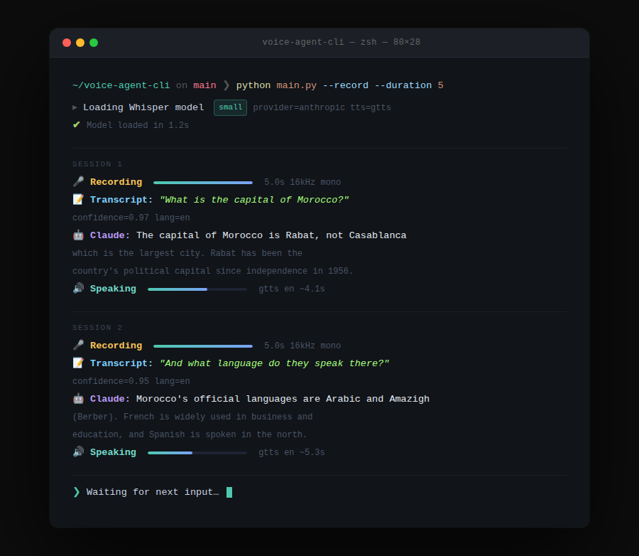

# voice-agent-cli 🤖

A minimal but complete voice AI agent that chains Speech-to-Text, an LLM, and
Text-to-Speech into a single CLI pipeline — record speech, get an intelligent
spoken response.

Repository: https://github.com/Omnia9789/voice-agent-cli



## Overview

This prototype mirrors the core architecture of production voice AI systems:
audio input is transcribed by Whisper, the transcript is sent to an LLM
(Anthropic Claude or OpenAI GPT), and the response is converted back to speech
and played to the user — all from the command line.

```
[ Audio Input ]
      ↓
[ Whisper STT ]
      ↓
[ LLM (Claude / GPT) ]
      ↓
[ TTS (gTTS / pyttsx3) ]
      ↓
[ Audio Output ]
```

## Features

- Record live audio via microphone or load a `.wav` / `.mp3` file
- Transcribe speech with OpenAI Whisper (`small` model by default)
- Send transcript to Claude (Anthropic) or GPT (OpenAI) with configurable system prompt
- Convert LLM response to speech and auto-play
- Modular design — swap any component independently
- Multi-turn conversation history across sessions

## Tech Stack

| Layer | Library |
|---|---|
| STT | [OpenAI Whisper](https://github.com/openai/whisper) |
| LLM | `anthropic` / `openai` |
| TTS | `gTTS` (online) or `pyttsx3` (offline) |
| Audio I/O | `sounddevice`, `soundfile`, `pygame` |
| Config | `python-dotenv` |

**Requires Python 3.10+**

## Project Structure

```
voice-agent-cli/
├── src/
│   ├── stt.py          # Whisper transcription
│   ├── llm.py          # LLM API calls (Claude / GPT)
│   ├── tts.py          # Text-to-speech output
│   └── audio_io.py     # Record / playback utilities
├── assets/
│   └── demo.png        # CLI screenshot
├── main.py             # Pipeline orchestration
├── .env.example        # API key template
├── requirements.txt
└── README.md
```

## Quickstart

```bash
git clone https://github.com/Omnia9789/voice-agent-cli.git
cd voice-agent-cli
pip install -r requirements.txt
cp .env.example .env   # fill in your API keys
```

**Load an audio file:**
```bash
python main.py --input path/to/audio.wav
```

**Record from microphone (5 seconds):**
```bash
python main.py --record --duration 5
```

**Multi-turn conversation (3 rounds):**
```bash
python main.py --record --turns 3
```

## Configuration

```env
# .env
ANTHROPIC_API_KEY=your_key_here
OPENAI_API_KEY=your_key_here        # Optional — only needed for GPT

LLM_PROVIDER=anthropic              # "anthropic" or "openai"
WHISPER_MODEL=small                 # tiny | base | small | medium | large
TTS_ENGINE=gtts                     # "gtts" (online) or "pyttsx3" (offline)
```

All settings can also be overridden via CLI flags:

```
--provider   anthropic | openai
--tts        gtts | pyttsx3
--whisper-model  tiny | base | small | medium | large
--duration   recording length in seconds
--turns      number of conversation turns (0 = loop)
--lang       BCP-47 language tag for TTS (e.g. ar, fr)
```

## Example Interaction

```
  voice-agent-cli  🤖
  provider=anthropic  tts=gtts  whisper=small

────────────────────────────────────────────────────
  SESSION 1
────────────────────────────────────────────────────
  🎤 Recording for 5.0s…  done.
  📝 Transcript: "What is the capital of Morocco?"
     confidence=0.97  lang=en
  🤖 Anthropic Response: The capital of Morocco is Rabat, not
     Casablanca which is the largest city. Rabat has been the
     country's political capital since independence in 1956.
  🔊 Speaking…

  ❯ Waiting for next input…  (Ctrl-C to quit)

────────────────────────────────────────────────────
  SESSION 2
────────────────────────────────────────────────────
  🎤 Recording for 5.0s…  done.
  📝 Transcript: "And what language do they speak there?"
     confidence=0.95  lang=en
  🤖 Anthropic Response: Morocco's official languages are Arabic
     and Amazigh (Berber). French is widely used in business and
     education, and Spanish is spoken in the north.
  🔊 Speaking…
```

## Swapping Components

Each module in `src/` is fully independent. To swap in a different STT engine,
replace `stt.py`'s `transcribe()` function while keeping the same return shape.
Same pattern applies to `llm.py` and `tts.py`.

## Roadmap

- [ ] Streaming LLM responses for lower latency
- [ ] Wake-word detection
- [ ] Arabic language support end-to-end
- [ ] Web UI wrapper

## License

MIT

## Publish To GitHub

If you copied this project locally (without `.git` history), run:

```bash
git init
git branch -M main
git remote add origin https://github.com/Omnia9789/voice-agent-cli.git
git add .
git commit -m "Initial commit: voice-agent-cli"
git push -u origin main
```
